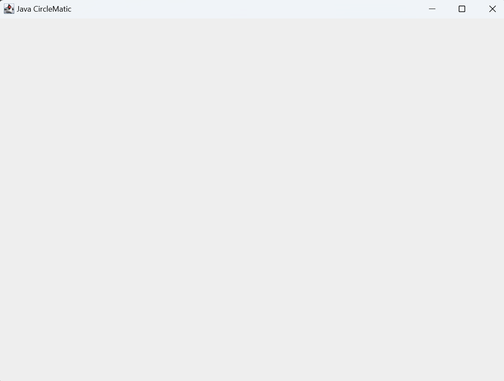
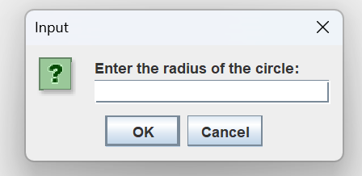
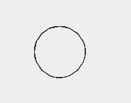
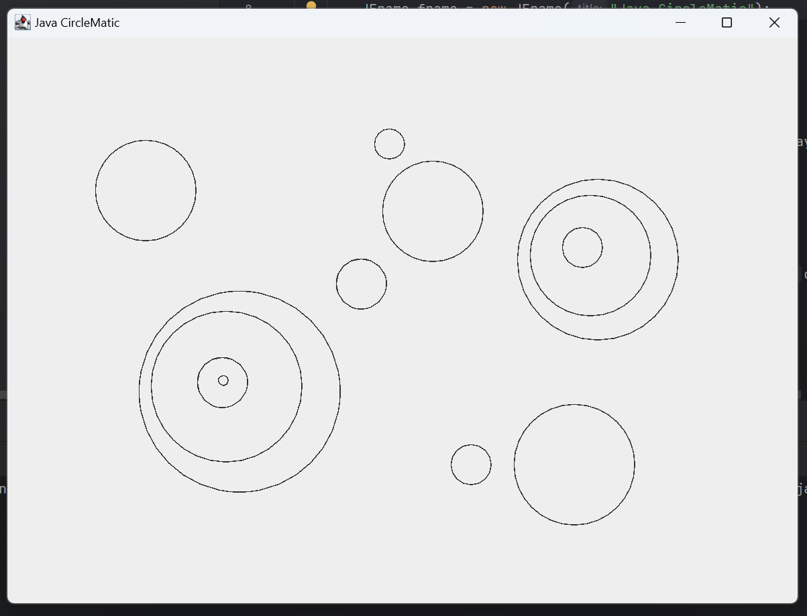

# Java CircleMatic

Java CircleMatic is a simple Java application that allows users to draw circles on a canvas by clicking on specific locations and specifying the radius. This project is designed to help beginners understand the basics of Java Swing and AWT for GUI applications.

## Features

- Click anywhere on the canvas to specify the center of the circle.
- Input the radius of the circle through a popup dialog.
- Draw circles at the specified locations with the given radius.

## Screenshots

1. **Initial Window**: The main window with the drawing panel.
   

2. **Prompt for Radius**: The input dialog to enter the radius.
   

3. **First Circle**: The canvas after drawing the first circle.
   

4. **Multiple Circles**: The canvas with multiple circles drawn.
   

## How to Run

1. Ensure you have Java installed on your machine.
2. Download or clone this repository.

    ```sh
    git clone https://github.com/yourusername/JavaCircleMatic.git
    cd JavaCircleMatic
    ```

3. Compile the Java program.

    ```sh
    javac SimpleCircleDrawingApp.java
    ```

4. Run the Java program.

    ```sh
    java SimpleCircleDrawingApp
    ```

## Code Explanation

The application consists of a single Java file `SimpleCircleDrawingApp.java`:

- **Main Frame**: The main frame is created using `JFrame` and set to a size of 800x600 pixels.
- **Drawing Panel**: A custom `JPanel` is used as the drawing canvas, where circles are drawn.
- **Mouse Listener**: A mouse listener captures the location of mouse clicks on the canvas.
- **Circle Drawing**: Circles are drawn based on user input for the radius, with the center at the mouse click location.

### Main Components

```java
// Main class to start the application
public class SimpleCircleDrawingApp {
    // Main method to create the frame and panel
    public static void main(String[] args) {
        // Code to create and display the frame and panel
    }
}

// Circle class to store circle properties
class Circle {
    int x, y, radius;
    public Circle(int x, int y, int radius) {
        this.x = x;
        this.y = y;
        this.radius = radius;
    }
}
